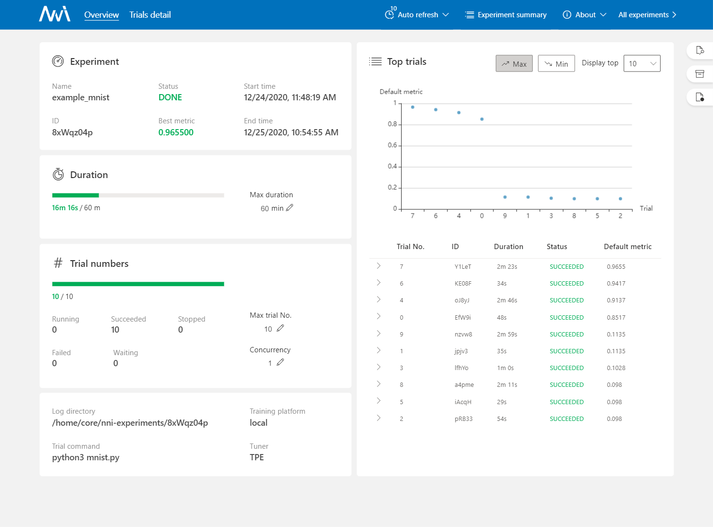
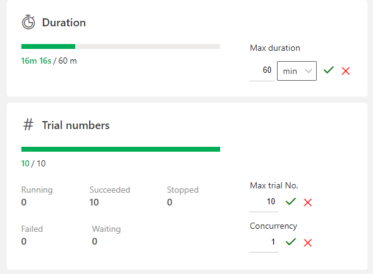
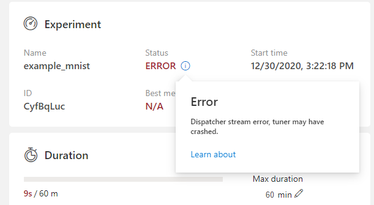
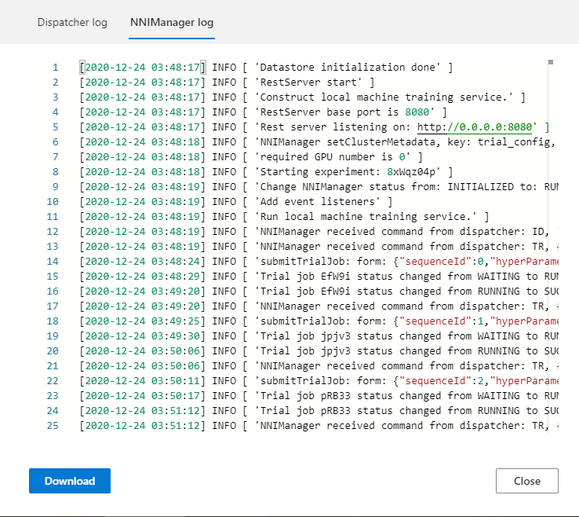
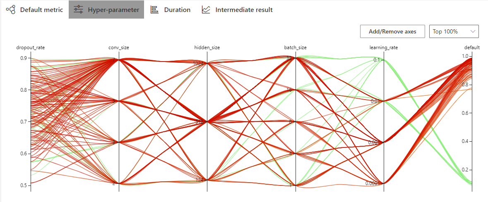
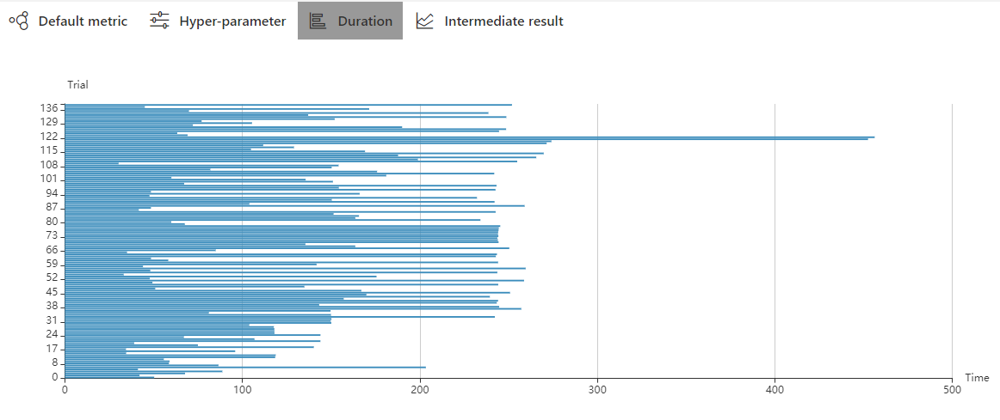
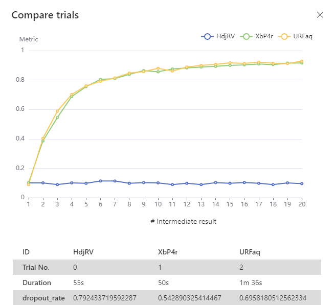
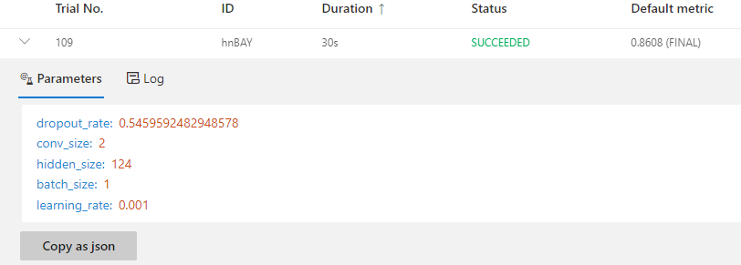
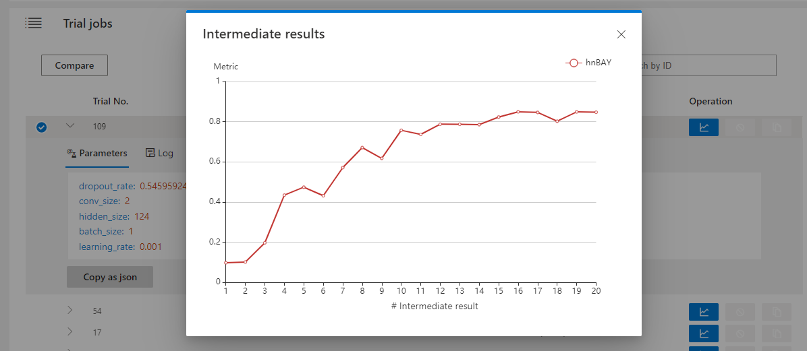

# WebUI

## View summary page

Click the tab "Overview".

* On the overview tab, you can see the experiment params and the performance of top trials. If you want to see config and search space, please click the right button "Config" and "Search space".

* If your experiment has many trials, you can change the refresh interval here.

* You can review and download the experiment results and nni-manager/dispatcher log files from the "Download" button.

* You can change experiment param such as maxExecDuration, maxTrialNum and trial concurrency on here.

* You can click the exclamation point in the error box to see a log message if the experiment's status is an error.

* You can click "About" to see the version and report any questions.

## View job default metric

* Click the tab "Default Metric" to see the point graph of all trials. Hover to see its specific default metric and search space message.

* Click the switch named "optimization curve" to see the experiment's optimization curve.

## View hyper parameter

Click the tab "Hyper Parameter" to see the parallel graph.

* You can add/remove axes and drag to swap axes on the chart.
* You can select the percentage to see top trials.

## View Trial Duration

Click the tab "Trial Duration" to see the bar graph.

## View Trial Intermediate Result Graph

Click the tab "Intermediate Result" to see the line graph.

The trial may have many intermediate results in the training process. In order to see the trend of some trials more clearly, we set a filtering function for the intermediate result graph.

You may find that these trials will get better or worse at an intermediate result. This indicates that it is an important and relevant intermediate result. To take a closer look at the point here, you need to enter its corresponding X-value at #Intermediate. Then input the range of metrics on this intermedia result. In the picture below, we choose the No. 4 intermediate result and set the range of metrics to 0.8-1.

## View trials status

Click the tab "Trials Detail" to see the status of all trials. Specifically:

* Trial detail: trial's id, trial's duration, start time, end time, status, accuracy, and search space file.

* The button named "Add column" can select which column to show on the table. If you run an experiment whose final result is a dict, you can see other keys in the table. You can choose the column "Intermediate count" to watch the trial's progress.

* If you want to compare some trials, you can select them and then click "Compare" to see the results.

* Support to search for a specific trial by it's id, status, Trial No. and parameters.

* You can use the button named "Copy as python" to copy the trial's parameters.

* If you run on the OpenPAI or Kubeflow platform, you can also see the nfs log.

* Intermediate Result Graph: you can see the default metric in this graph by clicking the intermediate button.

* Kill: you can kill a job that status is running.

